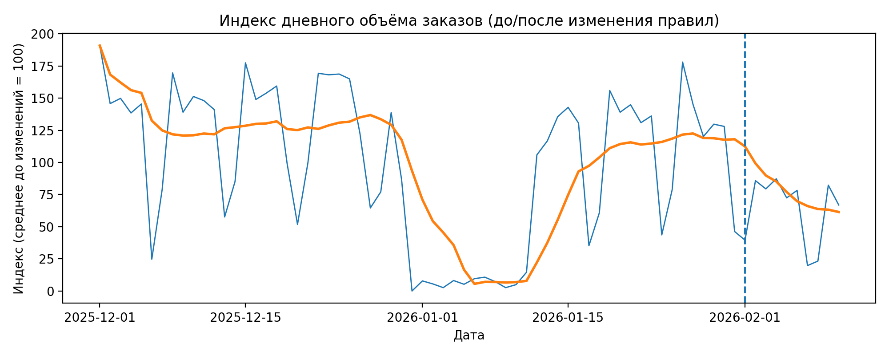
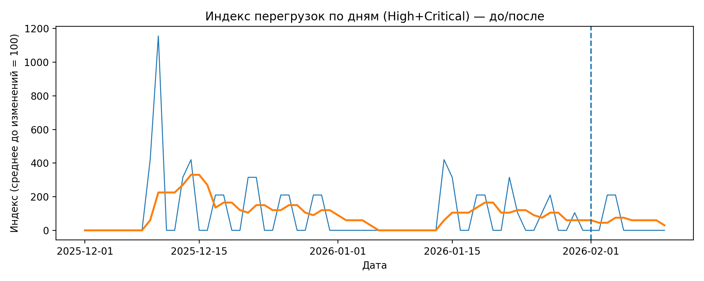

# Анализ изменений процесса (NDA)

Во внутреннем процессе периодически возникали перегрузки в пиковые периоды. С начала февраля в системе были внедрены изменения в правилах работы процесса.

Я наблюдал за системой со стороны операционной роли, фиксировал проблемные моменты, собирал данные и анализировал динамику, чтобы понять, как изменения повлияли на нагрузку и устойчивость процесса.

Все данные обезличены: используются индексы (среднее значение до изменений = 100), без публикации абсолютных значений.

---

## Что использовал

Две таблицы:

- дневной объём операций по датам;
- журнал перегрузок (дата, длительность, уровень нагрузки, комментарии).

---

## Моя роль в кейсе

- фиксировал проблемные ситуации в процессе;
- собирал и структурировал данные для анализа;
- формулировал гипотезы о причинах перегрузок;
- анализировал динамику до и после изменений;
- предлагал идеи по улучшению на основе наблюдений.

Важно: я не принимал решения о внедрении правил и не управлял процессом изменений. Проект — это независимый аналитический разбор наблюдаемой динамики.

---

## Как считал

- граница периодов “до / после” — 01.02;
- среднее значение до изменений принято за 100 (индекс);
- для снижения шума использовано сглаживание по 7 дням.

---

## Графики

Индекс дневного объёма:

Индекс перегрузок:

---

## Что получилось

После изменений правил наблюдается:

- снижение общего индекса нагрузки относительно периода “до”;
- заметное снижение перегрузок;
- более стабильная динамика в пиковые дни.

---

## Что заметил по журналу перегрузок

- перегрузка чаще возникает из-за накопления очереди, а не одного всплеска;
- пересечение разных потоков в один момент усиливает нагрузку;
- изменения сильнее заметны именно в периоды высокой активности.

---

## Ограничения анализа

- сравнение выполнено в формате “до / после” без контрольной группы;
- на динамику могли влиять внешние факторы (например, сезонность);
- выводы основаны на наблюдаемой динамике и журнале событий.

---

## Что бы я сделал дальше

Если бы это была рабочая задача, следующим шагом я бы:

- сравнил эффект отдельно для пиковых и обычных дней;
- добавил метрику времени обработки для оценки качества процесса;
- проверил устойчивость эффекта через более длинный период наблюдения.

---

## Инструменты

Python, Google Sheets
